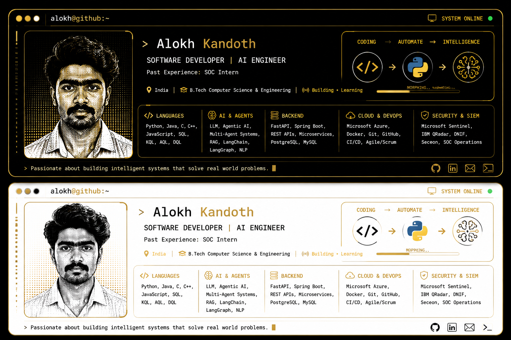

  

 

  

<picture>
  <source media="(prefers-color-scheme: dark)"
    srcset="https://raw.githubusercontent.com/Alokh-k/Alokh-k/output/github-snake-dark.svg" />
  <source media="(prefers-color-scheme: light)"
    srcset="https://raw.githubusercontent.com/Alokh-k/Alokh-k/output/github-snake.svg" />
  
</picture>

# Hi, I'm Alokh 👋

### Software Developer | FastAPI Developer | AI & Backend Enthusiast

I'm passionate about building scalable backend systems, authentication platforms, AI-powered applications, and cloud-native solutions.

## 🚀 Currently Working On
- ORAVCO ERP Services
- Authentik-based Identity Management
- AI Voice Agents
- FastAPI & Docker Projects

## 🛠️ Tech Stack

**Languages**
- Python
- Java
- JavaScript
- SQL

**Backend**
- FastAPI
- Flask
- Node.js

**Databases**
- PostgreSQL
- MySQL

**Tools**
- Docker
- Git
- GitHub
- Linux
- AWS

---

📫 Reach me: *(We'll add your LinkedIn, portfolio, badges, and GitHub stats later.)*

## 👨‍💻 About Me

Software Developer and AI Engineer with a strong interest in backend systems, agentic AI, cybersecurity, and cloud-native applications. I enjoy building scalable software, intelligent automation systems, and practical AI solutions.

- 🎓 B.Tech in Computer Science & Engineering
- 💼 Former SOC Intern
- 🤖 Building AI Agents, LLM Applications, and FastAPI Backends
- 🌱 Currently exploring Multi-Agent Systems, RAG, LangGraph, and Cloud Infrastructure
- 🚀 Passionate about Software Architecture, DevOps, and AI-driven Products

## 🛠️ Technical Skills

### Languages

### AI & Machine Learning

### Backend & Full Stack

### Databases

### DevOps & Cloud

### Security & SIEM

## 🚀 Featured Projects

### 🎤 Agentic AI Interviewing System
An AI-powered interview platform using Large Language Models, Agentic AI, LangGraph, and FastAPI to conduct intelligent, adaptive technical interviews with automated evaluation and feedback.

**Tech:** Python • FastAPI • LangGraph • LLMs • PostgreSQL

---

### 🚗 Daguerre Technology
An in-car health monitoring system that continuously monitors driver health and detects emergencies to improve road safety.

**Tech:** AI • IoT • Python • Machine Learning

---

### 🏠 Startup Remote
A home service booking platform that connects customers with professional cleaning services through a modern web application.

**Tech:** React • FastAPI • PostgreSQL • REST APIs

---

### 📚 Reading Aid for Individuals with Learning Disabilities Using TTS
A Text-to-Speech application designed to assist students with dyslexia through intelligent reading support and accessibility features.

**Tech:** Python • NLP • Text-to-Speech

**Publication:** IJSREM

---

### 🧠 Evana – Agentic AI Mental Health Support
An AI mental health assistant that provides conversational support using LLMs, memory, and agent-based workflows.

**Tech:** Agentic AI • LangChain • FastAPI • LLMs
